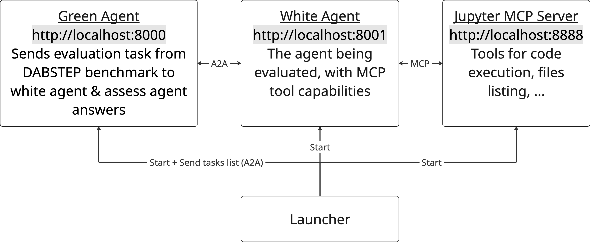

# DABench AgentBeats Implementation

A complete A2A (Agent-to-Agent) compatible implementation of the DABench benchmark, following the AgentBeats methodology with Green Agent (evaluator) and White Agent (test subject) architecture.

## Overview



This project implements the [DABench](https://github.com/InfiAgent/InfiAgent/tree/main/examples/DA-Agent/data) benchmark as an A2A-compatible evaluation system where:

- **Green Agent** (Evaluator): Manages DABench assessments and evaluates other agents
- **White Agent** (Test Subject): The agent being evaluated, with MCP tool capabilities
- **Launcher**: One-command execution script for easy setup and evaluation

The Data Agent Benchmark (DABench) is designed to measure and push the state-of-the-art in Data Analysis by LLMs.

## Features

- ✅ **A2A Protocol Compatible**: Full compatibility with Agent-to-Agent communication standard
- ✅ **DABench Scoring**: DABench benchmark scoring methodology with Pydantic Eval
- ✅ **AgentBeats Architecture**: Proper green/white agent separation
- ✅ **LLM Provider Integration**: 100+ LLM providers via LiteLLM (OpenAI, Anthropic, Google, Cohere, Ollama, etc.)
- ✅ **MCP Tools Integration**: White agent supports jupyter-mcp-server tools
- ✅ **One-Command Launch**: Simple launcher script for complete setup
- ✅ **Interactive Mode**: Real-time evaluation and monitoring capabilities
- ✅ **Environment Configuration**: Flexible configuration via .env files

## Quick Start

### Installation

```bash
# Install dependencies
pip install -r requirements.txt

# Copy and configure environment
cp .env.example .env
# Edit .env with your API keys and model preferences
```

### Launch Both Agents

```bash
# Start both green and white agents
python launcher.py

# Full dataset evaluation (450 tasks)
python launcher.py --evaluate --full

# Quick sample evaluation (1 task)
python launcher.py --evaluate --quick-sample 1
```

## Configuration

### Environment Variables

The system uses environment variables for configuration. Copy `.env.example` to `.env` and configure:

```bash
# Agent Settings

# LLM Configuration (LiteLLM supports 100+ providers)
LLM_API_KEY=your_api_key_here
GREEN_AGENT_MODEL=gpt-3.5-turbo     # Any LiteLLM-supported model
WHITE_AGENT_MODEL=gpt-4             # Any LiteLLM-supported model

# For Azure OpenAI (additional config)
AZURE_OPENAI_ENDPOINT=https://your-resource.openai.azure.com/
AZURE_OPENAI_API_VERSION=2024-02-15-preview
```

## JupyterLab MCP Server Integration

The White Agent is integrated with **JupyterLab MCP (Model Context Protocol) Server** for enhanced data analysis and code execution capabilities. This integration provides the agent with powerful computational tools for autonomous problem-solving.


### Authentication & Security

#### Token-Based Authentication
The MCP server uses Bearer token authentication for security:

```python
# White Agent automatically uses token from environment
headers = {"Authorization": f"Bearer {self.jupyter_token}"}

# Automatic fallback to no-auth if token fails
# (for development environments)
```

#### Network Configuration
- **Default Port**: 8888 (JupyterLab standard)
- **MCP Endpoints**: `http://localhost:8888/mcp/*`
- **Health Check**: `http://localhost:8888/mcp/healthz`
- **Tools List**: `http://localhost:8888/mcp/tools/list`
- **Tool Execution**: `http://localhost:8888/mcp/tools/call`

### Data Context Files

The White Agent has access to DABench data files in `agent-workings/data/`:

- **`payments.csv`** - Transaction data for financial analysis
- **`acquirer_countries.csv`** - Country mapping data
- **`merchant_category_codes.csv`** - Business category classifications
- **`merchant_data.json`** - Merchant information database
- **`fees.json`** - Fee structure data
- **`manual.md`** - Documentation and context information
